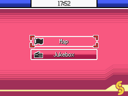

# Watch in the Pokegear Menu
This script is for Pokémon Essentials. It add a watch in the Pokégear menu.

## Screens

## Compatibility
Doesn't work on Essentials versions 16.2 and older.

## Installation
Follow the [Script](/Script.rb) instructions. The sample script files are in [Files folder](/Files).